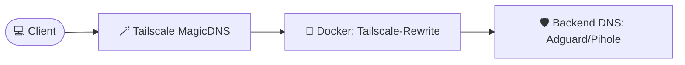

# 🛡️ Tailscale DNS Monitor & Rewriter

A high-performance Tailscale DNS server that provides custom DNS overrides and intelligent upstream forwarding with a premium real-time monitoring dashboard.

## 🔄 DNS Flow



## ✨ Features

- **🚀 Tailscale Native**: Seamlessly integrates with your Tailscale network.
- **⚡ Real-time Monitor**: **(NEW)** Real-time updates via Server-Sent Events (SSE). No more polling!
- **📈 Advanced Stats**: **(NEW)** Cache hit ratio tracking and node-specific traffic analytics.
- **💾 Persistent Logging**: Optimized for storage using JSONL with automatic archiving and 72h retention.
- **🔒 Encrypted Storage**: **(NEW)** AES-GCM encryption with PBKDF2 for on-disk history files.
- **🏥 Parallel Health Checks**: Continuous concurrent monitoring of upstream DNS servers with automatic failover.
- **🛡️ Security First**: Hardened Content Security Policy (CSP), built-in XSS protection, non-root execution support, and secure file permissions.
- **🌐 Advanced Upstreams**: **(NEW)** Support for `IP#port` notation for custom upstream DNS servers.

---

## 🚀 Quick Start

### 1. Deploy
```bash
docker-compose up -d --build
```
*Note: Use `./history` and `./tailscale` volumes for data persistence.*

---

## ⚙️ Configuration

| Variable | Description | Default |
|----------|-------------|---------|
| `TS_AUTHKEY` | Tailscale Authentication Key (Required) | - |
| `UPSTREAM_DNS` | Space-separated upstream DNS servers (supports `IP#port`) | `8.8.8.8 8.8.4.4` |
| `DOMAINS` | Comma-separated `domain:ip` mappings | - |
| `HEALTHCHECK_DOMAIN` | Domain used for upstream health checks | `google.com` |
| `PORT` | Web GUI listening port | `35353` |
| `HISTORY_PASSWORD` | Password to encrypt history files on disk (AES-GCM) | - |
| `PBKDF2_ITERATIONS`| Iteration count for PBKDF2 key derivation | `600000` |
| `INGEST_SECRET` | Secret token to authenticate logs from slave nodes | - |
| `MODE` | Run mode (`master` or `slave`) | `master` |
| `MASTER_URL` | URL of the Master node (Required for `slave` mode) | - |
| `NODE_NAME` | Unique identifier for the node in the dashboard | Hostname |

### Performance Optimization
The provided `docker-compose.yaml` includes kernel `sysctls` optimizations:
- `net.core.somaxconn=1024`: Higher connection backlog for heavy traffic.
- `net.ipv4.tcp_fastopen=3`: Reduces latency for repeated TCP connections.

---

### Example Mapping
`DOMAINS=.internal.net:100.1.2.3,app.example.com:100.4.5.6`

---

## 🛠️ How It Works

1. **Tailscale Connection**: The container joins your Tailnet and gets a unique IP.
2. **DNS Logic**: `dnsmasq` listens on the Tailscale IP, resolving custom mappings first and then forwarding to healthy upstreams.
3. **In-Memory Pipe**: Logs are streamed from `dnsmasq` through a named pipe directly into the Web GUI's RAM buffer.
4. **Persistent Logging**: History is stored on disk and archived every 30 minutes, preserving visibility. Archives rotate and are retained for 72h before deletion to manage disk usage.

---

## 🛠️ Development & Quality Assurance

### Unit Testing
The project includes a comprehensive suite of unit tests covering log parsing, API endpoints, state management, and slave forwarding.
```bash
go test -v ./webgui
```

### Security & Linting
We maintain high code quality and security standards using the following tools:
- **`gosec`**: Security auditing for Go code.
- **`govulncheck`**: Scans for known vulnerabilities in dependencies.
- **`golangci-lint`**: Aggregates various linters including `revive` and `gocritic`.

---

## 🔍 Troubleshooting

- **Check Logs**: `docker logs dns-tailscale-1`
- **Verify DNS**: `nslookup mydomain.internal <TAILSCALE_IP>`
- **Tailscale Status**: `docker exec -it dns-tailscale-1 tailscale status`
- **Upstream Health**: `docker exec -it dns-tailscale-1 dig @<UPSTREAM_IP> google.com`

---

## 📜 License

[MIT License](LICENSE)
