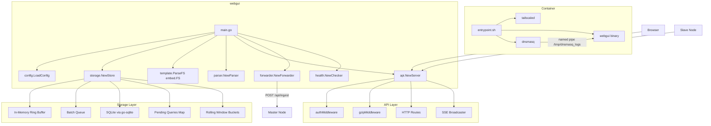
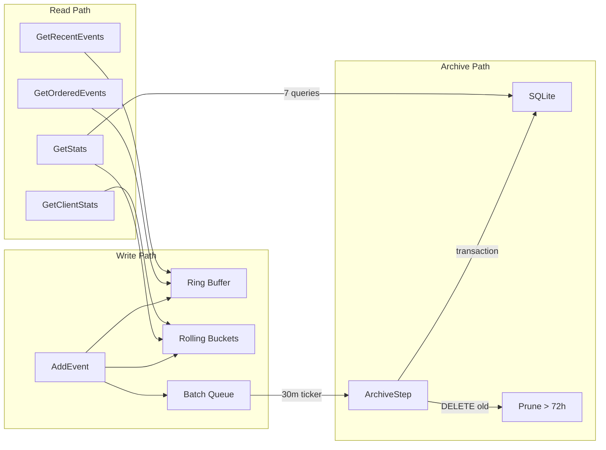
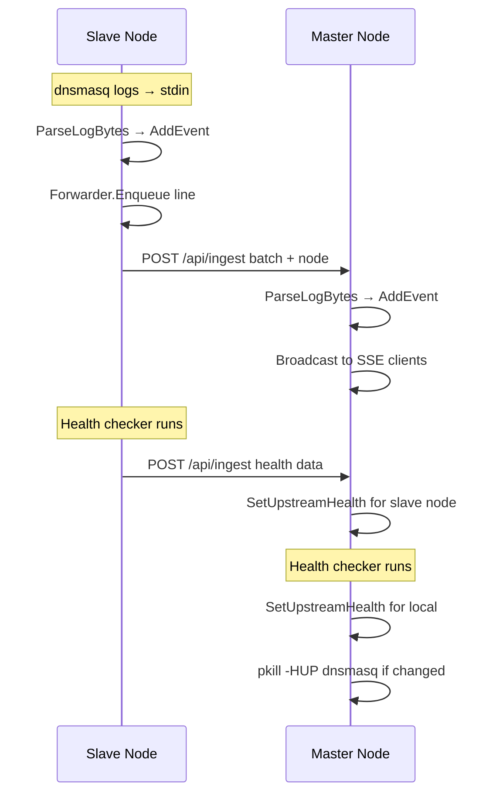
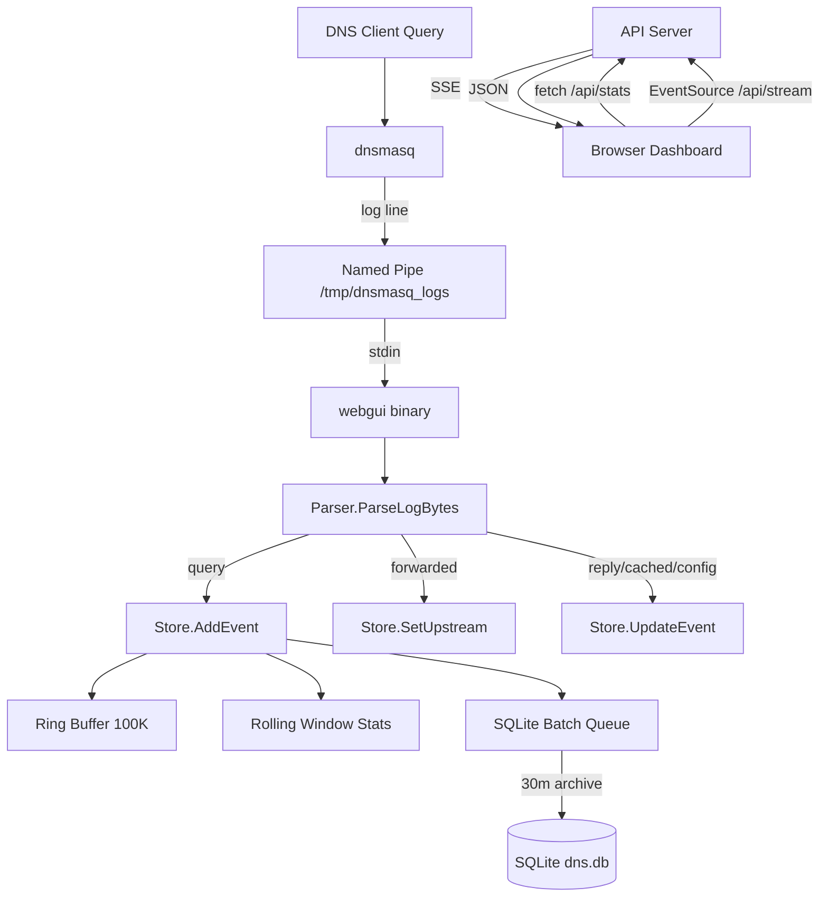
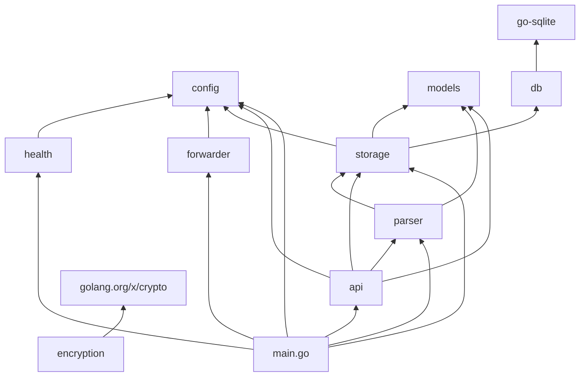

# Tailscale DNS Rewrite — Comprehensive Architecture Analysis

**Version Analyzed:** 2.0.0  
**Date:** 2026-06-10  
**Purpose:** Baseline analysis for planning a large set of feature implementations

---

## 1. High-Level Architecture Overview



The application is a single Go binary (`webgui`) that runs inside a Docker container alongside `tailscaled` and `dnsmasq`. It reads dnsmasq log output from a named pipe on stdin, parses DNS query/reply events, stores them in an in-memory ring buffer with periodic SQLite persistence, and serves a real-time web dashboard via SSE.

---

## 2. File-by-File Analysis

### 2.1 [`main.go`](webgui/main.go) — Entry Point & Orchestration

**Key responsibilities:**
- Loads configuration via [`config.LoadConfig()`](webgui/internal/config/config.go:56)
- Initializes the storage layer, parser, API server, forwarder, and health checker
- Sets up `embed.FS` for templates: `//go:embed templates/*` at [line 27](webgui/main.go:27)
- Parses templates via [`template.ParseFS(templates, "templates/*.html")`](webgui/main.go:36)
- Manages the application lifecycle with `context.WithCancel`

**Goroutines launched:**
| Goroutine | Purpose | Trigger |
|-----------|---------|---------|
| Health checker | [`checker.Start(ctx, callback)`](webgui/main.go:50) | 15s ticker inside health package |
| Stats trends | [`store.StartStatsTrends(ctx)`](webgui/main.go:59) | 5m ticker inside storage package |
| History archiver | [`store.ArchiveStep(time.Now())`](webgui/main.go:70) | `cfg.ArchiveInterval` ticker (default 30m) |
| Cleanup pending | [`store.CleanupPending(time.Now())`](webgui/main.go:84) | `cfg.CleanupInterval` ticker (default 10s) |
| Forwarder | [`fwd.Start()`](webgui/main.go:93) | Continuous loop with 100ms poll |
| Log ingestion | stdin scanner → [`prs.ParseLogBytes()`](webgui/main.go:139) | Blocking stdin read |
| HTTP server | [`srv.Start(ctx)`](webgui/main.go:151) | Listens on configured port |

**Log ingestion flow:**
1. `bufio.Scanner` reads from `os.Stdin` (the named pipe)
2. Lines containing `query[` or `reply` are classified as data lines
3. Other lines are logged with `[DNSMASQ]` prefix
4. In slave mode, lines are also enqueued to the forwarder
5. Each line is parsed via `prs.ParseLogBytes()` and broadcast via `srv.Broadcast()`

**Shutdown:** Signal handler for `SIGINT`/`SIGTERM` cancels context, then `fwd.Stop()` with 1s grace period.

**Notable:** No `embed.FS` usage for static assets — only templates. No static file server is configured.

---

### 2.2 [`api/api.go`](webgui/internal/api/api.go) — HTTP API & Session Management

#### Server struct (line 29-38)
```go
type Server struct {
    cfg         *config.Config
    store       *storage.Store
    parser      *parser.Parser
    tmpl        *template.Template
    subscribers map[chan models.QueryEvent]int  // SSE subscribers with drop counters
    subMu       sync.Mutex
}
```

#### Route Table

| Route | Method | Auth | Handler | Purpose |
|-------|--------|------|---------|---------|
| `/login` | GET/POST | Public | [`handleLogin`](webgui/internal/api/api.go:123) | Login page & form submission |
| `/logout` | Any | Public | [`handleLogout`](webgui/internal/api/api.go:156) | Clears session cookie |
| `/` | GET | `authMiddleware` | [`handleRoot`](webgui/internal/api/api.go:225) | Main dashboard (SSR) |
| `/api/events` | GET | `authMiddleware` | [`handleEvents`](webgui/internal/api/api.go:239) | Recent events JSON |
| `/api/stats` | GET | `authMiddleware` | [`handleStats`](webgui/internal/api/api.go:250) | Aggregated statistics |
| `/api/client_stats` | GET | `authMiddleware` + IngestSecret | [`handleClientStats`](webgui/internal/api/api.go:256) | Per-client RPM/RPH |
| `/api/simulate` | GET | `authMiddleware` | [`handleSimulate`](webgui/internal/api/api.go:276) | DNS resolution simulator |
| `/api/ingest` | POST | IngestSecret (if set) | [`handleIngest`](webgui/internal/api/api.go:167) | Slave → Master log ingestion |
| `/api/stream` | GET | `authMiddleware` | [`handleStream`](webgui/internal/api/api.go:308) | SSE real-time event stream |

**Route structure quirk:** The mux is nested — an inner `mux` handles most routes, then a `rootMux` wraps it and adds `/api/stream` separately. This appears to be for middleware isolation (stream doesn't go through gzip).

#### Authentication & Session Mechanism

**Cookie-based session** ([`authMiddleware`](webgui/internal/api/api.go:99)):
- Cookie name: `ts_dns_session` (constant at [line 26](webgui/internal/api/api.go:26))
- Cookie value: literal string `"authenticated"` — **NOT a cryptographic token**
- Settings: `HttpOnly=true`, `SameSite=LaxMode`, `Path=/`, `MaxAge=604800` (7 days)
- **Missing:** `Secure` flag is NOT set — cookie transmitted over plain HTTP
- Auth bypass: If `WebUsername` or `WebPassword` is empty, all requests are allowed through
- Login comparison: Direct string equality (`==`) — **NOT constant-time** for the login form handler
- Logout: Sets cookie `MaxAge=-1` to delete

**Ingest authentication** ([`handleIngest`](webgui/internal/api/api.go:167)):
- Uses `crypto/subtle.ConstantTimeCompare` for Bearer token comparison ✓
- Token format: `Authorization: Bearer <INGEST_SECRET>`
- If `IngestSecret` is empty, ingest endpoint is **unauthenticated**

**Client stats authentication** ([`handleClientStats`](webgui/internal/api/api.go:256)):
- Also uses `IngestSecret` Bearer token if configured
- This is inconsistent — it uses the API auth (ingest secret) rather than the web session cookie

#### Middleware

| Middleware | Scope | Purpose |
|-----------|-------|---------|
| [`authMiddleware`](webgui/internal/api/api.go:99) | Per-route (explicit wrapping) | Session cookie check, redirect to `/login` for HTML, 401 for API |
| [`gzipMiddleware`](webgui/internal/api/api.go:362) | Wraps inner mux | Gzip compression for responses |

**Missing middleware:**
- No CSP headers set on API responses (only in HTML meta tag)
- No rate limiting
- No request logging
- No CORS headers
- No request ID/tracing
- No timeout middleware (only `ReadHeaderTimeout: 5s` and `IdleTimeout: 120s` on the server)

#### SSE Broadcaster ([`Broadcast`](webgui/internal/api/api.go:52))
- Fan-out to all subscribers with non-blocking sends
- Tracks drop count per subscriber channel
- After >10 drops, subscriber is evicted (channel deleted but NOT closed — comment says "prevent panic")
- Channel buffer size: 100 events
- Keepalive: 30s comment lines (`: keepalive\n\n`)

#### Ingest Endpoint Protections
- `MaxBytesReader` 1MB limit on body
- Batch size limit: 100 lines
- Per-line size limit: 1024 bytes
- Input validation: `net.ParseIP()` for client_stats IP parameter

#### DNS Simulator ([`handleSimulate`](webgui/internal/api/api.go:276))
- Uses `net.Resolver` with 5s timeout
- Returns resolved IPs or error with appropriate HTTP status codes
- **Potential SSRF risk:** No domain allowlist/blocklist

---

### 2.3 [`config/config.go`](webgui/internal/config/config.go) — Configuration Model

#### Config struct (line 34-53)

| Field | Type | Env Var | Default | Validation |
|-------|------|---------|---------|------------|
| `Mode` | string | `MODE` | `"master"` | Must be "master" or "slave" |
| `MasterURL` | string | `MASTER_URL` | `""` | URL parse validation; required if slave |
| `NodeName` | string | `NODE_NAME` | hostname | Fallback to `os.Hostname()` |
| `Port` | string | `PORT` | `"35353"` | Numeric 1-65535 |
| `HistoryDir` | string | `HISTORY_DIR` | `"/var/lib/tailscale-dnsrewrite"` | — |
| `MaxEvents` | int | — | `100000` | Hardcoded constant |
| `HealthDomain` | string | `HEALTHCHECK_DOMAIN` | `"google.com"` | — |
| `CleanupInterval` | time.Duration | — | `10s` | Hardcoded constant |
| `ArchiveInterval` | time.Duration | — | `30m` | Hardcoded constant |
| `HistoryRetention` | time.Duration | — | `72h` | Hardcoded constant |
| `IngestSecret` | string | `INGEST_SECRET` | `""` | — |
| `WebUsername` | string | `WEB_USERNAME` | `""` | — |
| `WebPassword` | string | `WEB_PASSWORD` | `""` | — |
| `ScanLimit` | int | — | `1000` | Hardcoded constant |
| `MaxBacklogSize` | int64 | — | `10MB` | Hardcoded constant |
| `UpstreamDNS` | string | `UPSTREAM_DNS` | `""` | — |
| `ClientAliases` | map[string]string | `CLIENT_ALIASES` | `nil` | Format: `ip1:alias1,ip2:alias2` |
| `Debug` | bool | `DEBUG` | `false` | Must be `"true"` |

**Notable:** Many tuning parameters are hardcoded constants with no env var override (MaxEvents, CleanupInterval, ArchiveInterval, HistoryRetention, ScanLimit, MaxBacklogSize). Only the PBKDF2 iteration count has an env var override (`PBKDF2_ITERATIONS`).

---

### 2.4 [`db/db.go`](webgui/internal/db/db.go) — Database Initialization

#### SQLite Driver
- Uses [`github.com/glebarez/go-sqlite`](webgui/go.mod:6) (pure-Go SQLite, no CGO required)
- Driver name: `"sqlite"` (not `"sqlite3"`)

#### PRAGMA Settings (line 34-39)

| PRAGMA | Value | Purpose |
|--------|-------|---------|
| `journal_mode` | `WAL` | Write-Ahead Logging for concurrent reads during writes |
| `synchronous` | `NORMAL` | Balance between safety and speed (less fsync than FULL) |
| `busy_timeout` | `5000` | 5s wait on lock contention |
| `cache_size` | `-64000` | 64MB page cache (negative = kilobytes) |

#### Connection Settings
- `SetMaxOpenConns(1)` — Single writer connection to avoid WAL writer contention
- **Missing:** `SetMaxIdleConns`, connection max lifetime

#### Schema (line 46-60)

```sql
CREATE TABLE IF NOT EXISTS queries (
    id         INTEGER PRIMARY KEY AUTOINCREMENT,
    unix_time  INTEGER NOT NULL,
    node       TEXT NOT NULL,
    client_ip  TEXT NOT NULL,
    domain     TEXT NOT NULL,
    type       TEXT NOT NULL,
    upstream   TEXT,
    latency    REAL
);

CREATE INDEX IF NOT EXISTS idx_queries_time       ON queries(unix_time);
CREATE INDEX IF NOT EXISTS idx_queries_domain     ON queries(domain);
CREATE INDEX IF NOT EXISTS idx_queries_client_ip  ON queries(client_ip);
CREATE INDEX IF NOT EXISTS idx_queries_node_time  ON queries(node, unix_time);
```

**Schema observations:**
- No `created_at` or insertion timestamp column (relies on `unix_time` from the log event)
- No `upstream` or `latency` indexes (queries filtering by upstream exist in GetStats)
- No composite index for common query patterns like `(client_ip, unix_time)`
- No table for configuration, sessions, or metadata — purely a query event log
- No migration system — schema is created via `CREATE TABLE IF NOT EXISTS`

---

### 2.5 [`encryption/encryption.go`](webgui/internal/encryption/encryption.go) — Encryption Utilities

**Purpose:** AES-GCM encryption with PBKDF2 key derivation. Currently defined but **NOT called** from any other package in the codebase.

| Function | Purpose |
|----------|---------|
| [`Encrypt()`](webgui/internal/encryption/encryption.go:56) | AES-GCM encrypt with PBKDF2-derived key, base64 output |
| [`Decrypt()`](webgui/internal/encryption/encryption.go:85) | AES-GCM decrypt with backward-compatible old format support |
| [`getKey()`](webgui/internal/encryption/encryption.go:37) | PBKDF2 key derivation with caching (double-checked locking) |

**Key derivation details:**
- PBKDF2 with HMAC-SHA256, 600,000 iterations (configurable via `PBKDF2_ITERATIONS` env var, minimum 100,000)
- Fixed salt: `"TailscaleDNSHist"` (16 bytes) — **security concern**: static salt reduces uniqueness
- Key cache: `map[string][]byte` with `sync.RWMutex` — caches derived keys per password
- Key length: 32 bytes (AES-256)

**Format evolution:**
- Old format: `[16-byte random salt][nonce][ciphertext]`
- New format: `[nonce][ciphertext]` (no per-line salt, uses fixed salt + cached key)
- Decrypt function tries new format first, falls back to old format

**Dead code:** This package is imported nowhere. It appears to be prepared for encrypted history file storage but is not yet integrated.

---

### 2.6 [`forwarder/forwarder.go`](webgui/internal/forwarder/forwarder.go) — Log Forwarding (Slave Mode)

**Purpose:** Batches log lines and forwards them from slave nodes to the master's `/api/ingest` endpoint.

#### Forwarder struct (line 16-23)
```go
type Forwarder struct {
    cfg             *config.Config
    stopChan        chan struct{}
    stopOnce        sync.Once
    backlogMu       sync.Mutex
    backlog         []string
    backlogTotalSize int64
}
```

**Key behaviors:**
- [`Enqueue()`](webgui/internal/forwarder/forwarder.go:34): Appends lines to backlog, enforces `MaxBacklogSize` (10MB default) — silently drops when full
- [`Start()`](webgui/internal/forwarder/forwarder.go:84): Continuous loop polling backlog every 100ms, sends batches of up to 100 lines
- [`sendBatch()`](webgui/internal/forwarder/forwarder.go:50): POST to `MASTER_URL/api/ingest` with JSON payload, 10s HTTP timeout
- [`ReportHealth()`](webgui/internal/forwarder/forwarder.go:179): Async health report to master (5s timeout, separate HTTP client)
- [`Stop()`](webgui/internal/forwarder/forwarder.go:193): Clean shutdown via `stopOnce.Do(close(stopChan))`, 5s drain period

**Retry logic:**
- Exponential backoff: 1s → 2s → 4s → ... → 30s max
- On failure, failed batch is prepended back to backlog
- During drain mode, respects remaining time until drain deadline

**No-op mode:** If `cfg.Mode != "slave"` or `cfg.MasterURL == ""`, all methods return immediately.

---

### 2.7 [`health/health.go`](webgui/internal/health/health.go) — Upstream Health Checker

**Purpose:** Monitors upstream DNS server health via actual DNS resolution queries.

#### Checker struct (line 16-22)
```go
type Checker struct {
    cfg        *config.Config
    upstreams  []string
    healthy    []string
    latencies  map[string]float64
    mu         sync.RWMutex
}
```

**Key behaviors:**
- [`NewChecker()`](webgui/internal/health/health.go:25): Parses `UPSTREAM_DNS` (space-separated), defaults to `8.8.8.8, 8.8.4.4`, runs initial health check with 5s timeout
- [`CheckUpstream()`](webgui/internal/health/health.go:56): Creates custom `net.Resolver` dialing the upstream on UDP port 53 with 2s dial timeout, resolves `HealthDomain`, returns latency in ms
- [`Start()`](webgui/internal/health/health.go:73): 15s ticker, parallel checks via `sync.WaitGroup`, calls `onChange` callback when health status changes
- **Failover:** If all upstreams fail, preserves previous healthy set (line 123-128)
- **dnsmasq reload:** When healthy set changes, runs `pkill -HUP dnsmasq` (line 144) — **Linux-specific, will fail in tests or non-Linux environments**

**Latency measurement:** Time from dial to resolution completion, in milliseconds (microseconds / 1000.0).

---

### 2.8 [`models/models.go`](webgui/internal/models/models.go) — Data Models

#### QueryEvent struct (line 10-20)

| Field | Type | JSON Tag | Notes |
|-------|------|----------|-------|
| `UnixTime` | `int64` | `unix_time` | Unix timestamp |
| `Type` | `string` | `type` | DNS record type (A, AAAA, CNAME, etc.) |
| `Domain` | `string` | `domain` | Lowercase, trailing dot stripped |
| `ClientIP` | `string` | `client_ip` | Raw IP string |
| `Latency` | `*float64` | `latency_ms,omitempty` | Nil until reply received |
| `Upstream` | `string` | `upstream,omitempty` | Empty until reply/cached/config |
| `Node` | `string` | `node,omitempty` | Source node identifier |
| `Alias` | `string` | `alias,omitempty` | Client alias from config |
| `ID` | `string` | `id` | Auto-incrementing counter (string) |

**Custom JSON marshaling** ([`MarshalJSON()`](webgui/internal/models/models.go:36)): Adds computed fields `timestamp`, `timestampFormatted`, `latencyFormatted` alongside the base fields.

**Helper methods:**
- [`TimestampFormatted()`](webgui/internal/models/models.go:23): `HH:MM:SS` format
- [`LatencyFormatted()`](webgui/internal/models/models.go:28): `X.Xms` or `"-"` if nil

#### StatEntry struct (line 52-57)

| Field | Type | JSON Tag | Notes |
|-------|------|----------|-------|
| `Key` | `string` | `key` | Domain or IP |
| `Count` | `int` | `count` | Query count |
| `Trend` | `string` | `trend,omitempty` | "up", "down", or "stable" |
| `Alias` | `string` | `alias,omitempty` | Client alias (for client stats) |

---

### 2.9 [`parser/parser.go`](webgui/internal/parser/parser.go) — Log Parsing

**Purpose:** Parses dnsmasq log lines into `QueryEvent` objects and updates the store.

#### Parser struct (line 14-17)
```go
type Parser struct {
    store *storage.Store
    Debug bool
}
```

#### ParseLogBytes() (line 27) — Main parsing logic

**Recognized action tokens:**
| Token | Action | Store Effect |
|-------|--------|-------------|
| `query[X]` | DNS query for type X | Creates event, calls `store.SetPending()` and `store.AddEvent()` |
| `forwarded` | Query forwarded to upstream | Calls `store.SetUpstream()` |
| `reply` | DNS response received | Resolves pending, computes latency, calls `store.UpdateEvent()` |
| `cached` | Cache hit | Sets upstream to "System Cache" |
| `config` | Local config/override | Sets upstream to "Local Override" |

**Parsing details:**
- Timestamp parsing: Extracts first 3 space-separated fields, parses with `time.Stamp` format (`Jan 02 15:04:05`)
- Year inference: Uses current year, subtracts 1 year if parsed time is in the future
- Domain normalization: `strings.ToLower()` + strips trailing dot
- Client IP: Extracted from `query[X] domain from IP` pattern
- **Feature #200:** Upstream `127.0.0.1#5353` is recognized as "Local Override"

**Complexity:** Function is flagged with `//nolint:gocyclo` — cyclomatic complexity exceeds the 25 threshold.

**Return values:**
- Returns `*models.QueryEvent` only for `query[]` lines and resolved `reply/cached/config` lines
- `forwarded` lines return `nil` (they only update pending state)
- Unrecognized lines return `nil`

---

### 2.10 [`storage/storage.go`](webgui/internal/storage/storage.go) — Storage & State Management

This is the largest and most complex package. It manages:
1. In-memory ring buffer for recent events
2. Pending query tracking (for latency computation)
3. Rolling window statistics (RPM/RPH buckets)
4. SQLite batch writing and archival
5. Upstream health state
6. Trend analysis snapshots

#### Store struct (line 19-60)

**Ring buffer fields:**
- `events []models.QueryEvent` — Pre-allocated slice of size `MaxEvents` (default 100,000)
- `head int` — Next write position
- `count int` — Number of items in buffer
- `eventsMu sync.RWMutex` — Protects ring buffer access

**Pending query fields:**
- `pendingQueries map[string]map[string][]pendingInfo` — Nested map: `node → domain → []pendingInfo`
- `pendingInfo` contains `startTime` and `upstream`
- `pendingMu sync.Mutex` — Protects pending map

**Batch writing fields:**
- `batch []models.QueryEvent` — Buffer for SQLite inserts (capacity 1000)
- `batchMu sync.Mutex` — Protects batch

**Rolling window fields (per-second and per-minute buckets):**
- `rpmBuckets [60]int` / `rpmTimes [60]int64` — Global per-second RPM (60 buckets = 60 seconds)
- `rphBuckets [60]int` / `rphTimes [60]int64` — Global per-minute RPH (60 buckets = 60 minutes)
- `nodeRPMBuckets map[string]*[60]int` — Per-node RPM
- `nodeRPHBuckets map[string]*[60]int` — Per-node RPH
- `clientRPMBuckets map[string]*[60]int` — Per-client RPM
- `clientRPHBuckets map[string]*[60]int` — Per-client RPH
- `typeCounts map[string]int` — Query type counters

**Health fields:**
- `nodeUpstreamHealth map[string]map[string]float64` — `node → upstream → latency`
- `nodeUpstreamHealthHistory map[string]map[string][]float64` — `node → upstream → []latency` (last 20)
- `lastTopStats map[string][]models.StatEntry` — For trend computation

#### Key Methods

| Method | Purpose | Concurrency |
|--------|---------|-------------|
| [`AddEvent()`](webgui/internal/storage/storage.go:121) | Insert into ring buffer + update rolling buckets + add to SQLite batch | `statsMu.Lock` + `eventsMu.Lock` + `batchMu.Lock` |
| [`UpdateEvent()`](webgui/internal/storage/storage.go:204) | Find matching event in ring buffer, update latency/upstream | `eventsMu.Lock` + `batchMu.Lock` |
| [`GetOrderedEvents()`](webgui/internal/storage/storage.go:236) | Read N latest events from ring buffer | `eventsMu.RLock` |
| [`GetRecentEvents()`](webgui/internal/storage/storage.go:254) | Get events newer than timestamp | `eventsMu.RLock` |
| [`GetStats()`](webgui/internal/storage/storage.go:277) | Comprehensive stats from rolling buckets + SQLite | `statsMu.RLock` + `healthMu.RLock` + multiple SQLite queries |
| [`GetClientStats()`](webgui/internal/storage/storage.go:486) | Per-client RPM/RPH with 60-point history | `statsMu.RLock` |
| [`ArchiveStep()`](webgui/internal/storage/storage.go:600) | Batch insert into SQLite + prune old records | `batchMu.Lock` + SQLite transaction |
| [`SetPending()`](webgui/internal/storage/storage.go:554) / [`GetPending()`](webgui/internal/storage/storage.go:564) | Track in-flight queries | `pendingMu.Lock` |
| [`SetUpstream()`](webgui/internal/storage/storage.go:586) | Record upstream for pending query | `pendingMu.Lock` |
| [`SetUpstreamHealth()`](webgui/internal/storage/storage.go:652) | Update health state + history (last 20 samples) | `healthMu.Lock` |
| [`StartStatsTrends()`](webgui/internal/storage/storage.go:684) | 5-minute trend snapshot goroutine | Background goroutine |

**ArchiveStep details:**
- Swaps batch slice under lock, then inserts outside lock
- Uses SQLite transaction for batch insert
- Prunes records older than `HistoryRetention` (72h default)
- Returns count of inserted records

**GetStats() queries (line 327-413):**
- `SELECT COUNT(*) FROM queries` — Total events
- `SELECT COUNT(*) FROM queries WHERE unix_time >= ?` — 24h count (RPD)
- `SELECT COUNT(*) FROM queries WHERE upstream = 'System Cache' AND unix_time >= ?` — Cache hits
- `SELECT COUNT(*) FROM queries WHERE upstream != '' AND unix_time >= ?` — Total replies
- `SELECT domain, COUNT(*) ... GROUP BY domain ORDER BY c DESC LIMIT 10` — Top 10 domains
- `SELECT client_ip, COUNT(*) ... GROUP BY client_ip ORDER BY c DESC LIMIT 10` — Top 10 clients
- `SELECT unix_time / 3600, COUNT(*) ... GROUP BY hr` — Hourly heatmap

**Performance concern:** `GetStats()` runs 7+ SQLite queries on every poll (5s when tab visible, 60s when hidden). No caching of query results.

---

### 2.11 [`main_test.go`](webgui/main_test.go) — Existing Tests

| Test | Purpose | Coverage Area |
|------|---------|---------------|
| [`TestParseLogBytes`](webgui/main_test.go:39) | Query/forwarded/reply parsing + Local Override recognition | Parser |
| [`TestApiIngest`](webgui/main_test.go:89) | Batch ingest via HTTP | API + Storage |
| [`TestApiEvents`](webgui/main_test.go:118) | Event retrieval API | API |
| [`TestApiStats`](webgui/main_test.go:146) | Stats API after archival | API + Storage + SQLite |
| [`TestRootHandler`](webgui/main_test.go:176) | Dashboard HTML rendering | API + Templates |
| [`TestConcurrency`](webgui/main_test.go:191) | 10 workers × 50 iterations concurrent ingest | Concurrency |
| [`TestApiIngestAuth`](webgui/main_test.go:234) | Ingest secret enforcement | API Auth |
| [`TestParseLogMalformed`](webgui/main_test.go:265) | Edge cases in parsing | Parser |
| [`TestArchiveStep`](webgui/main_test.go:284) | SQLite archival | Storage |
| [`TestForwarder_NoPanic`](webgui/main_test.go:307) | Basic forwarder enqueue | Forwarder |

**Test infrastructure:**
- [`setupTest()`](webgui/main_test.go:23) creates a real `Store` with temp directory (real SQLite)
- Uses `httptest.NewRecorder()` for HTTP handler testing
- No mocking — tests use real components
- **Missing:** No tests for SSE streaming, health checker, encryption, login/logout flow, session auth, gzip middleware

---

### 2.12 [`templates/index.html`](webgui/templates/index.html) — Main Dashboard

#### CSP Meta Tag (line 6)
```html
<meta http-equiv="Content-Security-Policy" 
      content="default-src 'self'; 
               style-src 'self' 'unsafe-inline'; 
               script-src 'self' 'unsafe-inline'; 
               img-src 'self' data:; 
               font-src 'self' data:;">
```
**Observations:**
- `'unsafe-inline'` for both styles and scripts — weakens XSS protection significantly
- No `connect-src` directive — browser defaults allow same-origin + data: (SSE to `/api/stream` works)
- No `frame-ancestors` directive — clickjacking possible
- No `form-action` directive
- CSP is in meta tag only — not set as HTTP header by the Go server

#### Template Structure
- **All CSS is inline** (lines 9-304) — ~295 lines of CSS in a `<style>` block
- **All JS is inline** (lines 409-776) — ~367 lines of JavaScript in a `<script>` block
- **No external CSS/JS references** (fully self-contained via embed.FS)
- **No JavaScript framework** — vanilla JS with DOM manipulation
- **No module system** — all functions in global scope

#### CSS Architecture
- CSS custom properties (variables) for theming: `--bg-color`, `--glass-bg`, `--accent-color`, etc.
- Glassmorphism design: `backdrop-filter: blur()`, semi-transparent backgrounds
- Dark theme only (no light mode toggle)
- Responsive: `@media (max-width: 1024px)` collapses grid to single column
- Compact mode: `body.compact` class toggle reduces padding/font sizes

#### JavaScript Architecture
- **State:** `allEvents[]` array (max 1000), `rpmHistory[]` (20 points), `lastEventTimestamp`, `isTabVisible`, `isFrozen`
- **SSE connection:** `EventSource('/api/stream')` with auto-reconnect
- **Polling:** `fetchStats()` on interval (5s visible, 60s hidden) via `visibilitychange` event
- **Search:** Advanced filter parsing — supports `node:`, `type:`, `client:`, `alias:` prefixes
- **XSS protection:** [`escapeHtml()`](webgui/templates/index.html:410) function using `document.createElement('div').textContent` pattern
- **DOM management:** Max 100 rows in table, oldest removed when exceeded
- **Client stats modal:** Click on client IP opens modal with per-client RPM/RPH chart

#### Dashboard Cards
1. **Traffic Stats** — RPM mini chart + RPH/RPD/Cache Hit/Total counters
2. **Query Type Breakdown** — Horizontal bar chart of top 5 types
3. **Node Traffic** — Per-node RPM/RPH list
4. **Top Domains** — Top 10 with trend arrows
5. **Top Clients** — Top 10 with aliases and trend arrows
6. **Upstream Health** — Per-node upstream latency with sparklines
7. **24h Traffic Heatmap** — Hourly intensity grid

#### Server-Side Rendering
- Initial page load: Template executes with `{{range .Events}}` populating the table
- Subsequent updates: SSE + fetch API (client-side rendering)

---

### 2.13 [`templates/login.html`](webgui/templates/login.html) — Login Page

**External dependencies:**
- Google Fonts: `fonts.googleapis.com/css2?family=Inter...family=Outfit...` — **violates CSP `font-src 'self' data:`** directive
- Google Fonts preconnect: `fonts.googleapis.com`, `fonts.gstatic.com` — also violates CSP

**This is a CSP violation:** The login page loads external fonts but the CSP on the index page restricts `font-src` to `'self' data:`. The login page has **no CSP meta tag at all**.

**Template features:**
- Glassmorphism card design matching dashboard aesthetic
- Error message display via `{{if .Error}}` template block
- Form POST to `/login`
- Footer with hardcoded version "v2.0.0"

---

### 2.14 [`go.mod`](webgui/go.mod) — Dependencies

| Dependency | Version | Purpose |
|------------|---------|---------|
| `github.com/glebarez/go-sqlite` | v1.22.0 | Pure-Go SQLite driver (no CGO) |
| `golang.org/x/crypto` | v0.51.0 | PBKDF2 key derivation (used in encryption package) |

**Indirect dependencies:** `modernc.org/sqlite`, `modernc.org/libc`, `modernc.org/mathutil`, `modernc.org/memory`, `dustin/go-humanize`, `google/uuid`, `mattn/go-isatty`

**Go version:** 1.26.0

**Notable:** Very minimal dependency footprint. No HTTP framework, no ORM, no logging library.

---

### 2.15 [`.golangci.yml`](webgui/.golangci.yml) — Linter Configuration

**Enabled linters:** `revive`, `gocritic`, `gofmt`, `goimports`, `errcheck`, `staticcheck`, `unused`, `gosimple`, `gocyclo`, `misspell`, `unparam`

**Cyclomatic complexity threshold:** 25 (high — allows complex functions)

**Revive rules:** `exported`, `unused-parameter`, `var-naming`

---

### 2.16 [`Dockerfile`](Dockerfile) — Container Build

**Multi-stage build:**
1. **Builder:** `golang:1.26-alpine` → `CGO_ENABLED=0 GOOS=linux go build -ldflags="-s -w" -o webgui .`
2. **Runtime:** `alpine:3.23`

**Runtime dependencies:** `dnsmasq`, `bash`, `bind-tools`, `ca-certificates`, `iptables`, `iproute2`, `ip6tables`

**Tailscale binaries:** Copied from `tailscale/tailscale:stable` official image

**CRLF handling:** `sed -i 's/\r$//' entrypoint.sh` — strips Windows line endings

**Exposed ports:** `53/udp` (DNS), `35353/tcp` (Web GUI)

**Default env vars:** `MODE=master`, `PORT=35353`, `HISTORY_DIR=/var/lib/tailscale-dnsrewrite`

---

### 2.17 [`docker-compose.yaml`](docker-compose.yaml) — Compose Configuration

**Single service:** `dns-tailscale-1`
- Build context: `.` (project root)
- Port binding: `127.0.0.1:${PORT:-35353}:35353` — **only localhost access**
- Volumes: `./history` → `/var/lib/tailscale-dnsrewrite`, `./tailscale` → `/var/lib/tailscale`
- Sysctls: `net.core.somaxconn=1024`, `net.ipv4.tcp_fastopen=3`
- Restart policy: `unless-stopped`

**Environment variables set:** `TS_AUTHKEY`, `DOMAINS`, `UPSTREAM_DNS`, `HEALTHCHECK_DOMAIN`, `MODE`, `MASTER_URL`, `NODE_NAME`, `INGEST_SECRET`

**Missing from compose:** `WEB_USERNAME`, `WEB_PASSWORD`, `DEBUG`, `HISTORY_DIR`, `PORT`

---

### 2.18 [`entrypoint.sh`](entrypoint.sh) — Container Entrypoint

**Process orchestration:**
1. Sanitize env vars (strip CRLF/whitespace)
2. Start `tailscaled` with state dir and socket
3. Wait for socket (30s timeout)
4. Check existing Tailscale connection or authenticate with `TS_AUTHKEY`
5. Generate `/etc/dnsmasq.conf` from env vars
6. Create named pipe `/tmp/dnsmasq_logs`
7. Start `webgui` reading from pipe (stdin)
8. Start `dnsmasq` writing to pipe (stdout/stderr)
9. Monitor loop: checks both processes every 5s

**dnsmasq configuration generated:**
```
listen-address=$TAILSCALE_IP
port=53
bind-interfaces
cache-size=25000
dns-forward-max=150
strict-order
log-queries
log-async=25
log-facility=-
local-ttl=60
max-ttl=600
server=$UPSTREAM_DNS (per server)
address=/$domain/$ip (per DOMAINS entry)
```

**Signal handling:** `trap cleanup SIGINT SIGTERM` — kills all 3 child processes

**Named pipe flow:** `dnsmasq >> /tmp/dnsmasq_logs 2>&1` → `webgui < /tmp/dnsmasq_logs`

---

### 2.19 [`.env.example`](.env.example) — Environment Variable Template

Documents: `TS_AUTHKEY`, `UPSTREAM_DNS`, `DOMAINS`, `HEALTHCHECK_DOMAIN`, `PORT`, `MODE`, `MASTER_URL`, `NODE_NAME`

**Missing from .env.example:** `INGEST_SECRET`, `WEB_USERNAME`, `WEB_PASSWORD`, `DEBUG`, `HISTORY_DIR`, `CLIENT_ALIASES`, `PBKDF2_ITERATIONS`

---

## 3. Cross-Cutting Analysis

### 3.1 Security Patterns Summary

| Area | Current State | Risk Level |
|------|---------------|------------|
| Session cookie value | Static string `"authenticated"` | 🔴 High — trivially forgeable |
| Cookie `Secure` flag | Not set | 🟡 Medium — cookie sent over HTTP |
| Login password comparison | `==` (not constant-time) | 🟡 Medium — timing attack |
| Ingest auth | `subtle.ConstantTimeCompare` | 🟢 Good |
| CSP | Meta tag only, `'unsafe-inline'` | 🟡 Medium — weakened XSS protection |
| CSP on login page | Missing entirely | 🔴 High — no protection |
| Login page external fonts | Violates index page CSP | 🟡 Medium — inconsistency |
| DNS simulator | No domain restrictions | 🟡 Medium — SSRF potential |
| Encryption package | Defined but unused | ℹ️ N/A |
| Rate limiting | None | 🟡 Medium — brute force possible |
| HTTPS | Not enforced | 🟡 Medium — depends on deployment |

### 3.2 Database Access Patterns



**Lock ordering:** `statsMu` → `eventsMu` → `batchMu` → `pendingMu` → `healthMu`  
**Concern:** `AddEvent()` acquires `statsMu.Lock` then `eventsMu.Lock` then `batchMu.Lock` — three locks in sequence. `UpdateEvent()` acquires `eventsMu.Lock` then `batchMu.Lock`. No deadlock risk currently since lock ordering is consistent.

### 3.3 Master/Slave Architecture



**Key points:**
- Slave nodes parse logs locally AND forward raw lines to master
- Master re-parses the forwarded lines (double parsing)
- Health data flows from slave to master via the ingest endpoint
- Master does NOT send any data back to slaves
- No service discovery — slave `MASTER_URL` is statically configured
- No authentication for web sessions on slave nodes (if configured independently)

### 3.4 embed.FS Usage

Current usage is minimal:
```go
//go:embed templates/*
var templates embed.FS
```

Templates are parsed via `template.ParseFS(templates, "templates/*.html")`. No other static assets are embedded. There is no static file server — no CSS, JS, image, or font files are served separately.

### 3.5 Data Flow Summary



### 3.6 Configuration Gaps

| Parameter | Has Env Var | Configurable at Runtime | Documented |
|-----------|-------------|------------------------|------------|
| MaxEvents | ❌ | ❌ | ❌ |
| CleanupInterval | ❌ | ❌ | ❌ |
| ArchiveInterval | ❌ | ❌ | ❌ |
| HistoryRetention | ❌ | ❌ | ❌ |
| ScanLimit | ❌ | ❌ | ❌ |
| MaxBacklogSize | ❌ | ❌ | ❌ |
| PBKDF2_ITERATIONS | ✅ | ❌ | ❌ |
| INGEST_SECRET | ✅ | ❌ | ✅ |
| WEB_USERNAME | ✅ | ❌ | ❌ |
| WEB_PASSWORD | ✅ | ❌ | ❌ |
| CLIENT_ALIASES | ✅ | ❌ | ❌ |
| DEBUG | ✅ | ❌ | ❌ |

### 3.7 Missing Features / Gaps for Future Implementation

1. **No static asset pipeline** — All CSS/JS is inline in templates
2. **No API versioning** — All routes are unversioned (`/api/stats` not `/api/v1/stats`)
3. **No database migrations** — Schema created with `IF NOT EXISTS`, no evolution path
4. **No structured logging** — Uses `log.Printf` throughout
5. **No metrics/observability** — No Prometheus metrics, no tracing
6. **No graceful degradation** — If SQLite fails, `log.Fatalf` kills the process
7. **No HTTPS/TLS** — Relies on external reverse proxy or Tailscale network encryption
8. **No CSRF protection** — Login form has no CSRF token
9. **No rate limiting** — Login and ingest endpoints are unprotected from brute force
10. **No request logging** — No access logs from the HTTP server
11. **No health check endpoint** — The health checker monitors upstreams, but there's no `/healthz` for the app itself
12. **No configuration hot-reload** — All config is read once at startup
13. **No authentication for slave web GUI** — Slave nodes may expose dashboard without auth
14. **Encryption package unused** — Prepared for encrypted storage but not integrated
15. **No pagination** — Event listing uses fixed limits, no cursor/offset pagination
16. **No WebSocket support** — SSE only for real-time updates
17. **No user management** — Single hardcoded username/password
18. **No audit logging** — No record of login attempts or configuration changes

---

## 4. Dependency Graph



**Package dependency rules:**
- `models` is a leaf package (no internal dependencies)
- `config` is a leaf package (no internal dependencies)
- `db` depends only on `go-sqlite`
- `storage` depends on `config`, `db`, `models`
- `parser` depends on `storage`, `models`
- `api` depends on `config`, `storage`, `parser`, `models`
- `forwarder` depends on `config`
- `health` depends on `config`
- `encryption` depends on `golang.org/x/crypto` (external only)
- `main.go` is the orchestrator importing all packages except `encryption` and `db` (db is used via storage)

---

*End of architecture analysis document.*
